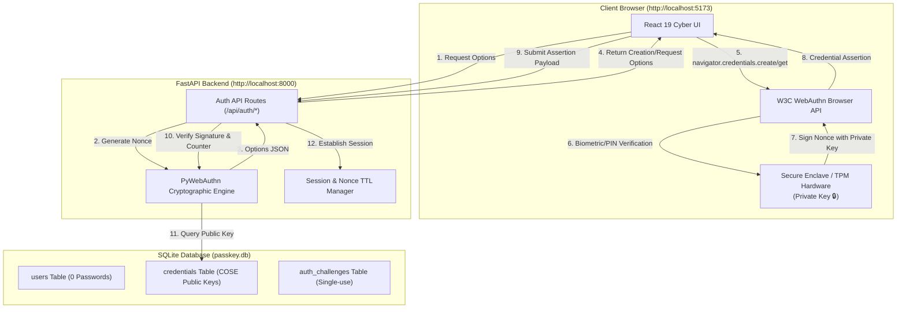

# Passwordless Authentication Using Passkeys and WebAuthn

> **College Seminar & Academic Capstone Project**  
> *Domain: Applied Cryptography, Web Security & FIDO2 Identity Systems*

---

## 1. Abstract

Traditional password-based authentication is the single largest liability in modern cybersecurity. Over 80% of enterprise security breaches originate from compromised, phished, or reused credentials. This project designs and implements a complete, production-grade passwordless authentication web application adhering to the **W3C WebAuthn (Level 3)** and **FIDO2** standards. By replacing shared-secret passwords with hardware-isolated asymmetric public-key cryptography (ECDSA over NIST P-256), the system eliminates the server password database entirely. User biometric verification (Windows Hello, Touch ID, Face ID) occurs strictly on the client hardware, ensuring zero passwords, zero private keys, and zero biometric data are ever transmitted or stored on the server.

---

## 2. Problem Statement & Objectives

### Problem Statement
Passwords require human memory to manage cryptographic complexity, resulting in short, reused, or written-down secrets. Even salted hashes stored on servers are vulnerable to offline GPU dictionary attacks once breached. Furthermore, traditional credentials lack cryptographic binding to the website origin, making them vulnerable to deceptive phishing attacks and Man-in-the-Middle (MitM) proxies.

### Project Objectives
1. **Zero-Password Storage**: Guarantee that the database schema contains **no password field**.
2. **Asymmetric Public-Key Cryptography**: Authenticate users via elliptic curve digital signatures (ECDSA P-256).
3. **Hardware Biometric Integration**: Leverage device platform authenticators (Windows Hello, Touch ID, device PIN).
4. **Phishing Resistance**: Enforce strict browser-level origin binding (`http://localhost:5173`) and Relying Party ID (`localhost`).
5. **Replay & Cloning Detection**: Implement cryptographically secure single-use nonces (5-minute TTL) and sign counter tracking.
6. **Academic Seminar Demonstration Mode**: Provide interactive educational visualizers for viva defense and seminar presentations.

---

## 3. Technology Stack

- **Frontend**:
  - **Framework**: React 19 + Vite 8
  - **WebAuthn Client API**: `@simplewebauthn/browser` (RFC-compliant W3C Level 3 JSON/Base64URL handler)
  - **Routing & Icons**: `react-router-dom`, `lucide-react`
  - **Styling**: Vanilla CSS Design Tokens (Cybersecurity dark theme, glassmorphism, glowing micro-animations)
- **Backend**:
  - **Framework**: Python 3.14 + FastAPI + Uvicorn
  - **Cryptographic Engine**: Duo Labs `webauthn` (PyWebAuthn v3.0.0)
  - **Data Layer**: SQLAlchemy 2.0 ORM + SQLite (`passkey.db`)
  - **Testing**: `pytest` + `httpx`

---

## 4. System Architecture



---

## 5. WebAuthn Cryptographic Sequences

### Registration Lifecycle (7 Steps)
1. **User Request**: User provides username, full name, and email.
2. **Challenge Generation**: Backend generates a 32-byte cryptographic random nonce with a 5-minute TTL.
3. **Browser Dispatch**: Frontend invokes `navigator.credentials.create()`.
4. **Local User Verification**: Device prompts for Fingerprint, Face ID, or PIN. Biometrics never leave the hardware.
5. **Keypair Generation**: Device Secure Enclave generates an ECDSA P-256 asymmetric keypair. Private key is locked in hardware.
6. **Server Registration**: Public key (in COSE format) and attestation signature are sent to the backend.
7. **Database Storage**: Backend verifies origin and challenge, then stores the public key. **Zero passwords are created.**

### Authentication Lifecycle (7 Steps)
1. **Login Trigger**: User requests sign-in with username (or discoverable passkey).
2. **Fresh Nonce**: Server returns a single-use random challenge.
3. **WebAuthn Invocation**: Browser calls `navigator.credentials.get()`.
4. **User Verification**: User touches fingerprint scanner or enters device PIN.
5. **Digital Signature**: Private key computes ECDSA signature over `authenticatorData` and `clientDataJSON`.
6. **Server Verification**: Backend verifies that the signature matches the stored public key, checks origin and sign counter.
7. **Access Granted**: Secure session token is issued, granting access to the protected dashboard.

---

## 6. Project Structure

```
d:/crypto/
│
├── frontend/
│   ├── src/
│   │   ├── components/
│   │   │   ├── Navbar.jsx           # Cyber navigation, compatibility badge & logout
│   │   │   └── Footer.jsx           # FIDO2 compliance badges & academic metadata
│   │   ├── pages/
│   │   │   ├── LandingPage.jsx      # Cyber hero, feature cards & architecture preview
│   │   │   ├── RegisterPage.jsx     # WebAuthn passkey registration with live animation
│   │   │   ├── LoginPage.jsx        # Passwordless sign-in with biometric prompt states
│   │   │   ├── DashboardPage.jsx    # Protected dashboard, multi-passkey manager & audit logs
│   │   │   ├── DemoPage.jsx         # Live 7-step hardware protocol execution & telemetry
│   │   │   ├── SecurityPage.jsx     # Educational phishing & brute-force attack simulations
│   │   │   ├── CryptographyPage.jsx  # ECDSA keypair diagram & interactive Web Crypto playground
│   │   │   ├── ArchitecturePage.jsx  # System blueprints & Viva examination technical glossary
│   │   │   ├── ThreatModelPage.jsx   # Detailed threat comparison matrix (Password vs Passkey)
│   │   │   └── SeminarPage.jsx      # 10-slide presentation deck with keyboard navigation
│   │   ├── services/
│   │   │   ├── api.js               # API client with bearer token management
│   │   │   └── webauthn.js          # @simplewebauthn/browser wrapper & error classification
│   │   ├── context/
│   │   │   └── AuthContext.jsx      # React authentication state & hardware detection
│   │   ├── App.jsx                  # React Router DOM configuration
│   │   ├── index.css                # Cybersecurity design system & glowing neon tokens
│   │   └── main.jsx
│   ├── package.json
│   └── vite.config.js               # Port 5173 with proxy to backend on port 8000
│
├── backend/
│   ├── app/
│   │   ├── auth/
│   │   │   └── webauthn_service.py  # PyWebAuthn registration & assertion verification
│   │   ├── middleware/
│   │   │   └── auth_middleware.py   # Bearer token session enforcement dependency
│   │   ├── routes/
│   │   │   ├── auth_routes.py       # Registration, login, logout, me, and status routes
│   │   │   └── credential_routes.py # Multi-passkey management (add/remove credentials)
│   │   ├── config.py                # Environment configuration (RP ID, Origin, Secret)
│   │   ├── database.py              # SQLAlchemy SQLite connection and sessionmaker
│   │   ├── models.py                # Database models (NO password column)
│   │   ├── schemas.py               # Pydantic v2 request/response schemas
│   │   └── main.py                  # FastAPI server with CORS & lifespan initialization
│   ├── tests/
│   │   └── test_auth.py             # 8 automated pytest integration tests
│   ├── requirements.txt             # Python dependencies
│   ├── .env.example                 # Configuration template
│   └── .env                         # Active configuration
│
├── docs/
│   ├── architecture.md              # Deep-dive system architecture & Mermaid diagrams
│   └── security.md                  # Cryptographic equations & threat model details
│
├── .gitignore
└── README.md
```

---

## 7. Installation & Running Locally

### Prerequisites
- **Python 3.11+** (Tested on Python 3.14)
- **Node.js 18+** (Tested on Node v22.21)
- **Modern Web Browser** with WebAuthn support (Chrome, Edge, Firefox, Brave, Safari)

---

### Step 1: Set Up and Run the Backend

Open a terminal in the project root:

```powershell
# Navigate to backend directory
cd d:\crypto\backend

# Install Python dependencies
python -m pip install -r requirements.txt

# Run automated test suite to verify cryptographic rules
python -m pytest tests/test_auth.py -v

# Start the FastAPI server
python -m uvicorn app.main:app --host 127.0.0.1 --port 8000 --reload
```

The backend will start at `http://127.0.0.1:8000`. You can inspect the interactive OpenAPI documentation at `http://127.0.0.1:8000/docs`.

---

### Step 2: Set Up and Run the Frontend

Open a second terminal:

```powershell
# Navigate to frontend directory
cd d:\crypto\frontend

# Install npm dependencies (if not already installed)
npm install

# Start the Vite development server
npm run dev
```

The frontend will start at `http://localhost:5173`. Open your browser and navigate to:
`http://localhost:5173`

---

## 8. How to Present During College Seminar

1. **Slide Mode (`/seminar`)**:
   - Click the **🎓 Seminar Mode** button in the navigation bar.
   - Use the **Next** button or keyboard arrow keys (`→`) to step through the 10 presentation slides.
2. **Interactive Cryptography Playground (`/cryptography`)**:
   - Click **Generate ECDSA Keypair & Sign Challenge** to watch the browser create real ECDSA P-256 keys.
   - Click **Test Tampered Challenge** to demonstrate mathematical verification rejection.
3. **Phishing & Brute-Force Demonstration (`/security`)**:
   - Switch between `example.com` and `evil-bank.com` to demonstrate how origin binding protects users.
   - Run the wordlist attack simulator to show how password cracking works versus uncrackable 256-bit elliptic curves.
4. **Live Protocol Execution (`/demo`)**:
   - Click **Start Live Hardware Demo** to execute genuine passkey authentication and view real-time protocol telemetry.
5. **Database Verification**:
   - Inspect `backend/passkey.db` to show the exam committee that the database contains **ZERO password fields**.

---

## 9. Limitations & Future Scope

### Limitations
- WebAuthn requires a secure context (`https://` in production, or `localhost` during development).
- Authenticators must support FIDO2/WebAuthn Level 3.

### Future Scope
- **Cross-Device Passkeys (Hybrid Transport)**: QR-code Bluetooth handshake for phone-to-laptop authentication.
- **Enterprise Single Sign-On (SSO)**: SAML 2.0 / OIDC passkey integration for corporate identity providers.
- **Continuous Zero-Trust Risk Assessment**: Dynamic step-up verification based on IP geolocation and device trust posture.

---

## 10. Conclusion

This project successfully proves that public-key cryptography and modern WebAuthn APIs eliminate passwords entirely. By storing only public keys on the server and securing private keys within device hardware, applications become immune to phishing, credential stuffing, and server database compromise.
