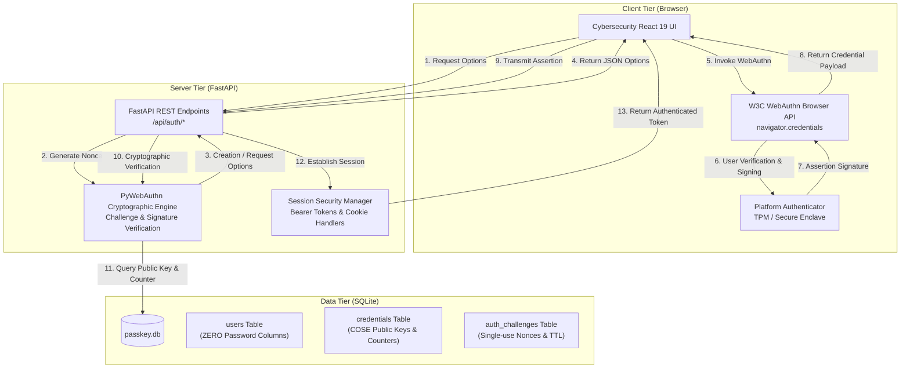
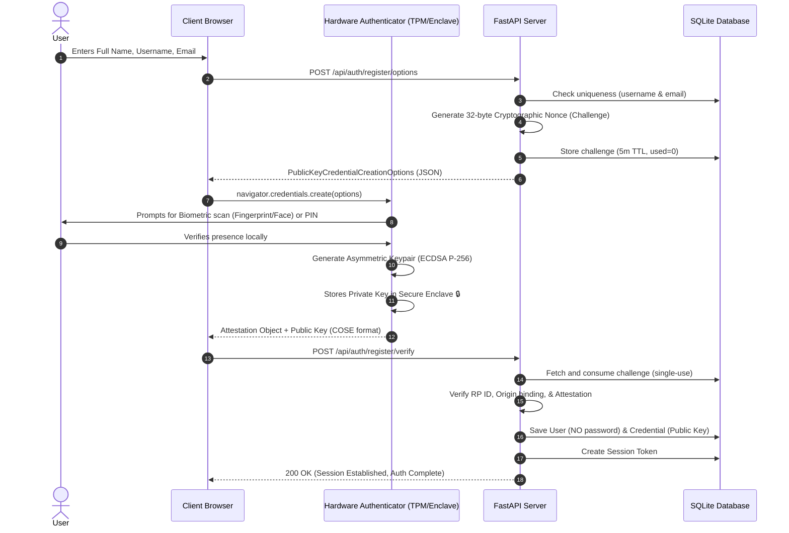
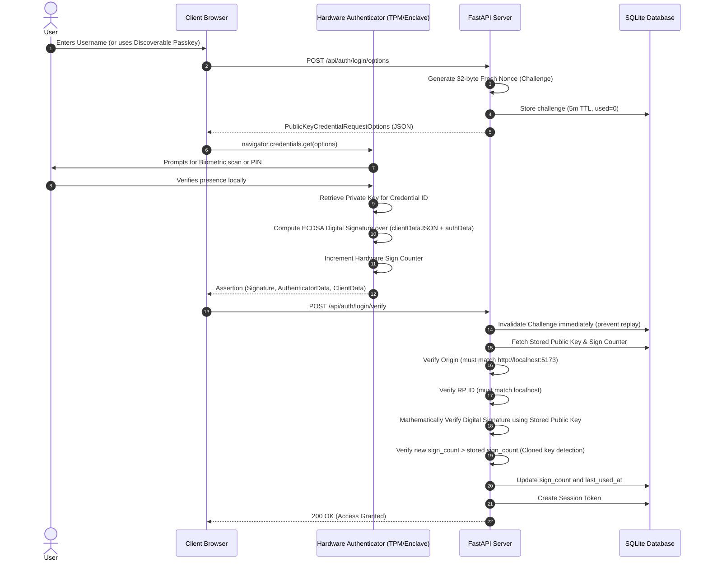

# System Architecture: Passwordless Authentication Using Passkeys and WebAuthn

## 1. Architectural Overview

This project implements a production-grade, zero-password authentication system adhering to the **W3C Web Authentication (WebAuthn) Level 3** and **FIDO2** specifications. The application decouples user identification from secret sharing, utilizing hardware-backed asymmetric key cryptography (ECDSA over NIST P-256 curve) to authenticate users with platform authenticators (Windows Hello, Touch ID, Face ID, PIN) or roaming hardware security keys (YubiKeys).

---

## 2. High-Level Component Architecture

---

## 3. WebAuthn Cryptographic Sequences

### A. Registration Flow (Credential Creation)

### B. Authentication Flow (Assertion Verification)

---

## 4. Database Schema Design

The SQLite database (`passkey.db`) contains zero password columns by design:

1. **`users` Table**:
   - `id` (VARCHAR(36), PK): UUID.
   - `full_name` (VARCHAR(100)): User display name.
   - `username` (VARCHAR(50), UNIQUE): Normalized alphanumeric handle.
   - `email` (VARCHAR(100), UNIQUE): Email address.
   - `created_at` (DATETIME): Timestamp.
   - `last_login` (DATETIME): Last successful authentication timestamp.

2. **`credentials` Table**:
   - `id` (VARCHAR(36), PK): UUID.
   - `user_id` (VARCHAR(36), FK -> users.id): Cascading foreign key.
   - `credential_id` (BLOB, UNIQUE): Globally unique credential identifier bytes.
   - `public_key` (BLOB): Public key bytes in CBOR/COSE format.
   - `sign_count` (INTEGER): Signature counter to detect cloned authenticators.
   - `transports` (TEXT): JSON array of supported transports (`["internal", "hybrid", "usb"]`).
   - `device_name` (VARCHAR(100)): Device label (e.g. "Work Laptop").
   - `aaguid` (VARCHAR(64)): Authenticator Attestation GUID.
   - `created_at` (DATETIME): Registration timestamp.
   - `last_used_at` (DATETIME): Timestamp of last signature verification.

3. **`auth_challenges` Table**:
   - `id` (VARCHAR(36), PK): UUID.
   - `challenge` (BLOB): 32-byte cryptographic nonce.
   - `username` (VARCHAR(50)): Associated username.
   - `purpose` (VARCHAR(20)): "registration" or "authentication".
   - `created_at` (DATETIME): Timestamp.
   - `expires_at` (DATETIME): TTL timestamp (5 minutes).
   - `used` (INTEGER): Single-use flag (1 = consumed).

4. **`sessions` Table**:
   - `id` (VARCHAR(64), PK): Cryptographic random urlsafe bearer token.
   - `user_id` (VARCHAR(36), FK -> users.id): Associated user.
   - `created_at` (DATETIME): Timestamp.
   - `expires_at` (DATETIME): Session expiration timestamp (7 days).

5. **`auth_logs` Table**:
   - `id` (VARCHAR(36), PK): UUID.
   - `user_id` (VARCHAR(36), FK -> users.id): Associated user.
   - `username` (VARCHAR(50)): Target username.
   - `event_type` (VARCHAR(50)): Event type (REGISTRATION_SUCCESS, LOGIN_SUCCESS, etc.).
   - `status` (VARCHAR(20)): SUCCESS, FAILED.
   - `details` (VARCHAR(255)): Non-sensitive description.
   - `timestamp` (DATETIME): Timestamp.
